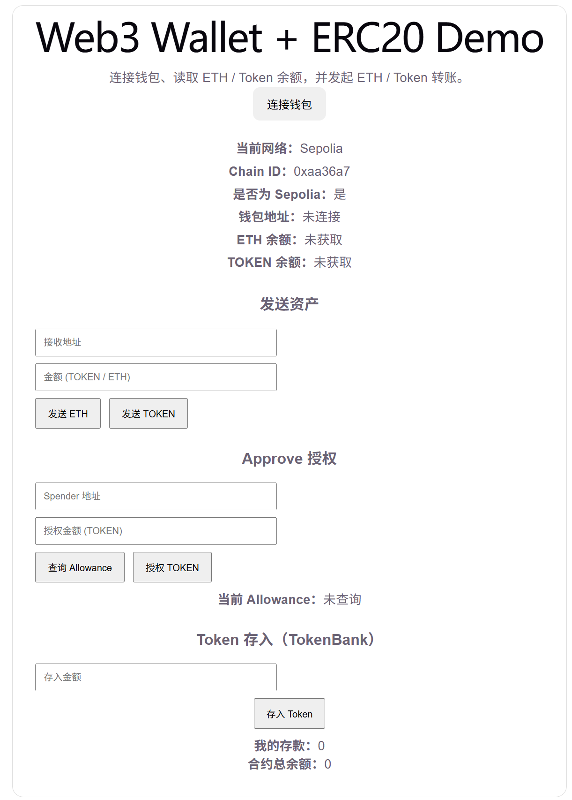
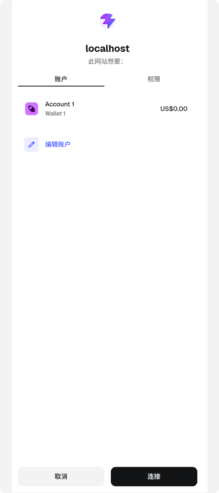
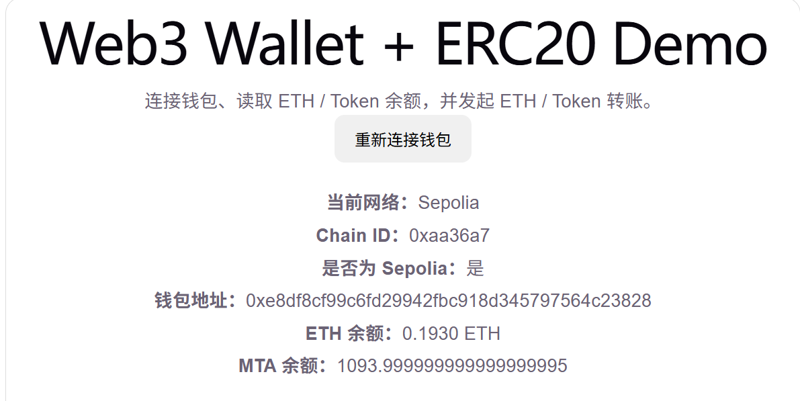
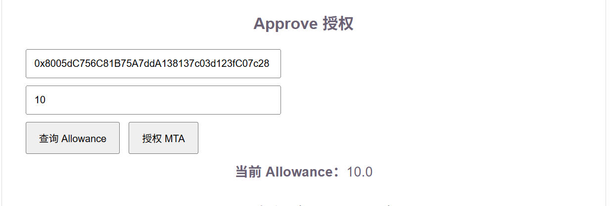
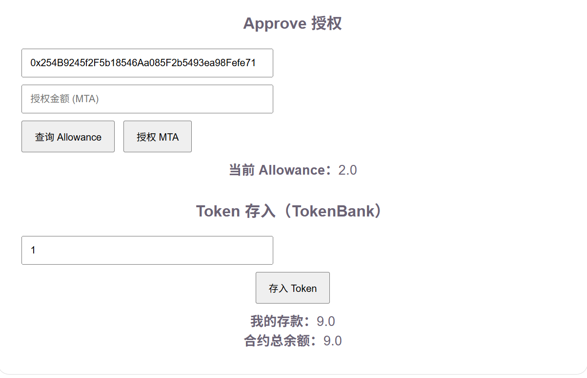

# ERC20 Vault DApp

一个基于 React + ethers.js 的 Web3 前端项目，实现 ERC20 Token 授权与代扣（approve + transferFrom）流程。

## 🌍 在线访问

https://erc20-vault-dapp.vercel.app/

## 🚀 功能

- 钱包连接（MetaMask）
- ETH 余额读取
- ERC20 Token 余额读取
- Token 转账（transfer）
- Token 授权（approve）
- 查询授权额度（allowance）
- Token 存入（deposit，合约通过 transferFrom 代扣）
- 显示用户存款与合约总余额

## 🔄 交易流程说明

1. 用户连接钱包
2. 调用 approve 授权 TokenBank
3. 调用 deposit
4. TokenBank 内部执行 transferFrom
5. 更新链上状态并返回结果

## 🧩 架构说明

- 前端通过 ethers.js 与链交互
- 使用 BrowserProvider 连接 MetaMask
- 所有写操作通过 signer 完成
- 合约调用基于 ABI

---

## 🧠 核心流程

用户 connect wallet
→ approve(TokenBank, amount)
→ 调用 deposit()
→ TokenBank 内部调用 transferFrom 扣款
→ 更新用户存款记录

---

## 🛠 技术栈

- React
- ethers.js
- MetaMask
- Solidity（ERC20 + TokenBank）

## 📦 合约地址（Sepolia）

- ERC20 Token: 你的token地址
- TokenBank: 你的bank地址

## 🖼 页面展示

1. 钱包连接
   
   
   

2. approve
   
   
   

3. deposit 成功
   
   
   

## 🧪 本地运行

```bash
npm install
npm run dev
```

## ⚠️ 注意

- 使用 Sepolia 测试网
- 需要 MetaMask
- 需要测试 ETH

## 📌 学习点

- ERC20 approve / allowance / transferFrom
- Web3 前端与合约交互
- 钱包签名与交易流程
